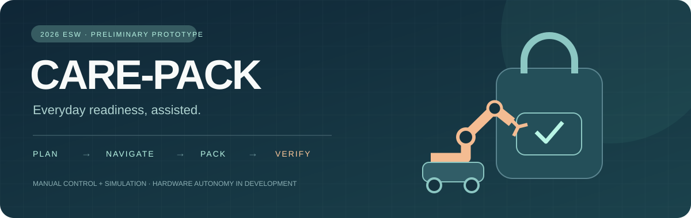
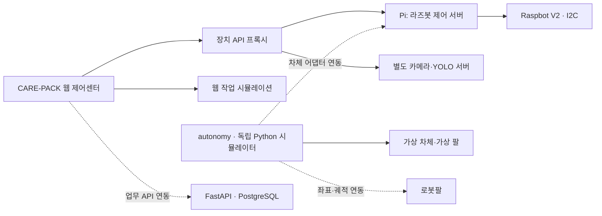
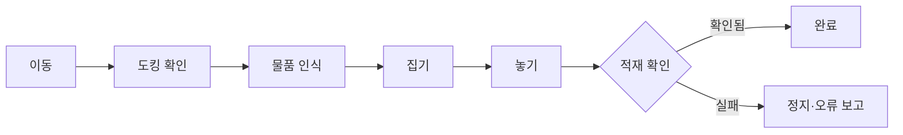

<div align="center">



# CARE-PACK
### 필요한 것을 챙기고, 담겼는지 확인하다.

2026 임베디드 소프트웨어 경진대회 · **예선 출품 프로젝트**

[저장소 안내](#repositories) · [프로젝트 소개](#프로젝트-소개) · [구현 현황](#구현-현황) · [시스템 구조](#시스템-구조) · [빠른 시작](#빠른-시작) · [개발 문서](#개발-문서)

</div>

> **제공 기능** — 라즈봇 수동 제어, 카메라 스트림 연동, SO-ARM101 제어 도구와 웹 작업 시뮬레이션을 제공합니다.
> 자율 작업은 `autonomy/`의 시뮬레이션으로 의사결정·상태 전이·실패 처리를 검증하며, 실제 장치 연동은 개발 로드맵에 따라 확장합니다.

<a id="repositories"></a>

## 📁 Repositories

CARE-PACK은 기능별 **독립 GitHub 저장소 6개**로 구성됩니다. 아래 Repository 링크는 이 저장소의 폴더가 아니라 각 프로젝트의 별도 저장소로 이동합니다.

| Repository | Documentation | License | Description |
|---|---|---|---|
| **[carepack_web](https://github.com/chaneepo/carepack_web)** | [Web Docs](https://github.com/chaneepo/carepack_web/blob/main/README.md) | 미지정 | 통합 웹 UI·라즈봇 리모컨·카메라 스트림·장치 프록시 |
| **[carepack_raspbot](https://github.com/chaneepo/carepack_raspbot)** | [Raspbot Docs](https://github.com/chaneepo/carepack_raspbot/blob/main/README.md) | 미지정 | Raspberry Pi 제어 서버·I2C·안전 제어·전용 UI |
| **[carepack_arm](https://github.com/chaneepo/carepack_arm)** | [Arm Docs](https://github.com/chaneepo/carepack_arm/blob/main/README.md) | 미지정 | SO-ARM101 Studio·ESP32 모터·리더암 제어 도구 |
| **[carepack_vision](https://github.com/chaneepo/carepack_vision)** | [Vision Docs](https://github.com/chaneepo/carepack_vision/blob/main/README.md) | 미지정 | SAM2 라벨링·YOLO segmentation 학습·추론·카메라 전용 서버 |
| **[carepack_autonomy](https://github.com/chaneepo/carepack_autonomy)** | [Autonomy Docs](https://github.com/chaneepo/carepack_autonomy/blob/main/README.md) | 미지정 | 자율 작업 흐름·라인 판단·실패 복구 시뮬레이션 |
| **[carepack_backend](https://github.com/chaneepo/carepack_backend)** | [Backend Docs](https://github.com/chaneepo/carepack_backend/blob/main/README.md) | 미지정 | FastAPI·PostgreSQL·데이터 모델·마이그레이션 |

> 저장소 라이선스는 별도 지정 전입니다. 외부 라이브러리의 라이선스는 각 프로젝트의 선언을 따릅니다.

이 메인 저장소는 프로젝트 소개·설계 문서와 **기존 통합 실행본**을 보존합니다. 기존 코드 폴더는 삭제하지 않았으며 새 저장소와 자동 동기화되지 않습니다. 새 모듈 개발은 해당 독립 저장소에서 진행하고 통합본 반영은 별도로 검토합니다. [저장소 구성·유지보수 안내](docs/REPOSITORIES.md)

## 프로젝트 소개

외출 직전, 필요한 물건을 찾고 가방에 넣는 과정까지 도와줄 수 있다면 어떨까요?

CARE-PACK은 사용자의 준비물 목록을 바탕으로 **물품 인식 → 집기·이동 → 가방 적재 → 결과 확인**을 연결하는 생활 보조 로봇을 목표로 합니다. 단순히 명령을 보내는 데서 끝나지 않고, 물건이 실제로 담겼는지 확인하는 것을 핵심으로 삼습니다.

| 준비하기 | 가져오기 | 확인하기 |
|:---:|:---:|:---:|
| 외출 상황별 물품·루틴 관리 | 이동 로봇과 로봇팔 협업 | 센서로 적재 결과 확인 |
| 웹 화면과 작업 모델 구현 | 수동 제어 + 자율 작업 시뮬레이션 | 검증 절차 설계·시뮬레이션 |

**설계 원칙: `명령 처리 성공 ≠ 실제 작업 성공`**

## 구현 현황

2026-09-02 기준, 모듈별 제공 기능과 실행 방식을 정리했습니다. 실기 운전 절차는 [운영 문서](raspbot_runtime/OPERATIONS.md)를 참고하세요.

| 기능 | 실행 방식 | 주요 내용 |
|---|---|---|
| 통합 제어센터 | 웹 UI | 대시보드·자동 작업·수동 제어·비전·물품·이력 화면 |
| 라즈봇 수동 제어 | Pi 제어 서버 연동 | 방향키·버튼, 짧은 이동, Pi 전용 UI의 회전각 입력 |
| 안전 제어 | 제어 서버·클라이언트 | 기본 이동 잠금, STOP 우선 처리, 운전 권한 만료, 통신 감시 |
| 카메라·YOLO 화면 | 카메라 서버 연동 | 별도 카메라 서버의 상태·MJPEG 영상 연결 |
| 팔·모터 제어 도구 | 독립 프로그램 | SO-ARM101 수동·고정 시퀀스·리더암 추종, ESP32 털기 도구 |
| 물품 인식 모델 학습 | 독립 파이프라인 | SAM2 자동 라벨링 → YOLO segmentation, car_key·lip_balm·watch 3종 학습(872장) |
| 작업 상태 전이·팔 UI | 시뮬레이션 | 계획·집기·이동·놓기·검증, 실패 복구 연출 |
| 라즈봇 자율주행 판단 | Python 시뮬레이션 | 라인 기반 방향 판단, 장애물·센서 유효성 검사 |
| 로봇팔 자율 작업 흐름 | Python 시뮬레이션 | 도킹 확인 후 집기·놓기, 파지 실패 시 1회 재시도 |
| PostgreSQL 기반 | DB·백엔드 도구 | 핵심 테이블 7개, Alembic, 시드, 테스트, 상태 확인 API |
| 웹 업무 데이터 | 메모리·목업 서비스 | 물품·루틴·작업 데이터와 화면 동작 확인 |

[자율 작업 시뮬레이션 안내](autonomy/README.md) · [안전 점검 기록](raspbot_runtime/SAFETY_REVIEW.md)

## 시스템 구조

실선은 현재 코드의 연결, 점선은 개발 로드맵에 따른 연동 계획입니다.



### 목표 자율 작업 흐름



`autonomy/`는 가상 관측값을 입력받아 위 흐름의 단계별 의사결정과 오류 처리를 재현합니다.

## 하드웨어와 기술 구성

| 구분 | 구성 | 역할 |
|---|---|---|
| 이동 플랫폼 | Yahboom Raspbot V2 | 메카넘 휠 이동, 라인·초음파 센서 |
| 제어 컴퓨터 | Raspberry Pi 5 · Ubuntu 24.04 | I2C 제어 서버와 카메라 처리 환경 |
| 로봇팔 | SO-ARM101 | 수동 제어·고정 자세 시퀀스·리더암 추종 |
| 카메라 | U20CAM · YOLO11 계열 | 영상 수집·객체 인식 실험 |
| 웹 | React 19 · TypeScript · Next.js API / vinext | 통합 제어 화면·장치 프록시 |
| 제어·시뮬레이션 | Python 3.12 | 안전 제어 계층, 독립 자율 작업 시뮬레이터 |
| 데이터 | FastAPI · SQLAlchemy · PostgreSQL · Alembic | 작업·물품·이벤트 저장 기반 |

팔 제어 도구의 실행 환경·포트·교정 설정은 [Motor & Arm Docs](motor/README.md)에서 확인할 수 있습니다.

## 빠른 시작

새 기능별 개발은 위 독립 저장소의 README를 따르세요. 아래는 기존 통합 실행본을 사용하는 방법입니다.

### 1. 코드 받기

```bash
git clone https://github.com/chaneepo/2026ESWContest_free_HomeProtector.git
cd 2026ESWContest_free_HomeProtector
```

### 2. 웹 제어센터

Node.js 22.13 이상이 필요합니다.

```bash
npm ci
npm run dev
```

장치 주소를 설정하지 않아도 화면과 기존 작업 시뮬레이션을 확인할 수 있습니다. 실제 기기는 연결 실패·이동 잠금으로 표시됩니다. 장치 연결이 필요할 때만 `.env.local`에 **직접 확인한 주소**를 설정하세요.

```dotenv
RASPBOT_API_URL=http://127.0.0.1:8090
# 카메라 서버를 별도로 확인한 뒤 설정
# CAMERA_API_URL=http://확인한-기기-IP:8000
```

위 주소는 로컬 데모 또는 SSH 터널 사용 예시이며 Pi 주소를 자동으로 찾아주지 않습니다.

### 3. 자율 작업 시뮬레이션 실행 — 로봇 불필요

추가 Python 패키지 없이 저장소 루트에서 실행합니다.

```bash
python3 -m autonomy --scenario success
python3 -m autonomy --scenario obstacle
python3 -m autonomy --scenario pick-failure
python3 -m autonomy --scenario verify-failure
```

출력의 `mode: SIMULATION_ONLY`, `hardware_executed: false`는 모든 시나리오에서 유지됩니다. 성공·실패·중단 흐름을 재현하며 실제 SSH·GPIO·CAN·모터 호출은 없습니다.

### 4. 라즈봇 전용 UI — 기본은 데모

```bash
cd raspbot_runtime
python3 server.py --host 127.0.0.1 --port 8090
```

브라우저에서 `http://127.0.0.1:8090`을 엽니다. 실기 연결·SSH 터널·배선·운전 절차는 [라즈봇 운영 문서](raspbot_runtime/OPERATIONS.md)를 참고하세요. 새 서버는 `--hardware`로 실행해도 **자동으로 운전 권한을 주지 않습니다.**

### 테스트

```bash
python3 -B -m unittest discover -s autonomy/tests -v
(cd raspbot_runtime && python3 -B -m unittest discover -s tests -v)
node --test raspbot_runtime/tests/control-client.test.mjs
npx tsc --noEmit --incremental false
npm run build
```

하드웨어 없이 실행하는 테스트입니다. 테스트 통과는 실제 바퀴·팔의 안전성이나 정확도 검증을 대체하지 않습니다.

## 개발 로드맵

수동 제어와 시뮬레이션을 기반으로, 다음 순서로 실제 장치 연동과 통합 검증을 확장할 계획입니다.

| 단계 | 확장 목표 |
|---|---|
| 주행·도킹 | 센서 극성·라인 오차·회전 시간 보정, 위치 추정·경로 계획·도킹 확인 신호 연결 |
| 팔 자율 작업 | 좌표계 보정·역기구학·작업 공간·속도 한계·궤적·충돌 회피 검증 |
| 적재 확인 | 파지·무게 센서로 물품 집기와 가방 적재 결과 확인 |
| 데이터 연동 | 물품·루틴·작업 API를 통한 웹 화면과 PostgreSQL 연결 |
| 통합 시험 | 사람이 감독하는 실물 시험, 반복 성공률·오차·시간 측정 |
| 운전 안전 | 하드웨어 비상정지·독립 watchdog·접근 인증 보강 |

## 개발 문서

| 내용 | 문서 |
|---|---|
| 개발환경·DB·Windows 상세 설정 | [한국어](docs/setup/README.ko.md) · [English](docs/setup/README.en.md) |
| 자율 작업 시뮬레이션·확장 설계 | [Autonomy Docs](autonomy/README.md) |
| 안전 점검·확인 범위 | [Safety Review](raspbot_runtime/SAFETY_REVIEW.md) |
| 라즈봇 실행·운영·진행 기록 | [README](raspbot_runtime/README.md) · [Operations](raspbot_runtime/OPERATIONS.md) · [Progress](raspbot_runtime/PROGRESS.md) |
| 시스템 설계 | [프로젝트 개요](docs/ko/00_PROJECT_OVERVIEW.md) · [아키텍처](docs/ko/01_SYSTEM_ARCHITECTURE.md) |
| 제어·비전 설계 | [상태기계](docs/ko/04_STATE_MACHINE.md) · [비전](docs/ko/05_VISION_DESIGN.md) · [팔 인터페이스](docs/ko/06_SO_ARM101_INTERFACE.md) |
| API·DB·검증 | [API](docs/ko/03_BACKEND_API_SPEC.md) · [DB](docs/ko/07_DATABASE_SCHEMA.md) · [실패 복구](docs/ko/10_FAILURE_RECOVERY.md) |
| 다음 구현 단계 | [로드맵](docs/ko/11_DEVELOPMENT_ROADMAP.md) · [팀 연동 규칙](docs/ko/12_TEAM_INTERFACE.md) |

모듈별 실행 방법은 각 폴더의 README에, 확장 목표와 인터페이스 설계는 `docs/`에 정리되어 있습니다.

## 안전하게 사용하기

- 실물 시험은 바퀴를 띄우고 주변을 비운 상태에서 사람이 지켜보며 시작합니다.
- 소프트웨어 STOP은 하드웨어 전원 차단을 대신하지 못합니다. 정지 응답이 실패하거나 실제로 멈추지 않으면 본체 전원을 차단하세요.
- 현재 제어 서버에는 사용자 로그인 인증이 없습니다. 인터넷 공개·포트 포워딩·전체 네트워크 방화벽 허용을 하지 마세요. 신뢰할 수 있는 로컬망 또는 SSH 터널을 사용합니다.
- 비밀번호·SSH 키·`.env.local`은 저장소에 올리지 않습니다.

<sub>문서 구성 참고: <a href="https://github.com/Dongbang-Yeuijiguk/2025ESWContest_smart_3019">2025ESWContest_smart_3019</a>.</sub>
