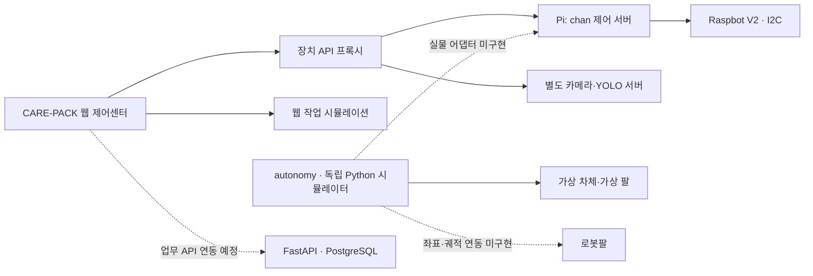
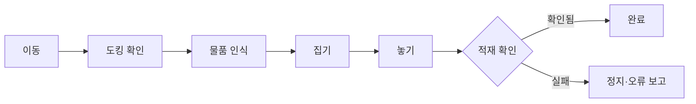

<div align="center">


# CARE-PACK
### 필요한 것을 챙기고, 담겼는지 확인하다.

2026 임베디드 소프트웨어 경진대회 프로젝트 · **예선 프로토타입**

[프로젝트 소개](#프로젝트-소개) · [구현 현황](#구현-현황) · [시스템 구조](#시스템-구조) · [빠른 시작](#빠른-시작) · [개발 문서](#개발-문서)

</div>

> **현재 상태** — 라즈봇 수동 제어 코드와 비전 스트림 연동, 웹 작업 시뮬레이션이 있습니다.
> **라즈봇 자율주행과 로봇팔의 실제 자율 작업은 미완성입니다.**
> `autonomy/`는 실제 장비에 명령을 보내지 않는 실행 가능한 시뮬레이션 초안입니다. 시뮬레이션 성공을 실물 시연 결과로 간주하지 않습니다.

## 프로젝트 소개

외출 직전, 필요한 물건을 찾고 가방에 넣는 과정까지 도와줄 수 있다면 어떨까요?

CARE-PACK은 사용자의 준비물 목록을 바탕으로 **물품 인식 → 집기·이동 → 가방 적재 → 결과 확인**을 연결하는 생활 보조 로봇을 목표로 합니다. 단순히 명령을 보내는 데서 끝나지 않고, 물건이 실제로 담겼는지 확인하는 것을 핵심으로 삼습니다.

| 준비하기 | 가져오기 | 확인하기 |
|:---:|:---:|:---:|
| 외출 상황별 물품·루틴 관리 | 이동 로봇과 로봇팔 협업 | 센서로 적재 결과 확인 |
| 웹 화면과 작업 모델 구현 | 수동 제어 + 자율 시뮬레이션 초안 | 검증 절차 설계·시뮬레이션 |

**설계 원칙: `명령 처리 성공 ≠ 실제 작업 성공`**

## 구현 현황

아래 표는 2026-09-02 코드 점검 기준입니다. “구현”은 현장 안전성 인증이나 현재 장치의 운행 가능 판정을 뜻하지 않습니다.

| 기능 | 상태 | 현재 범위 |
|---|---|---|
| 통합 제어센터 | 구현 | 대시보드·자동 작업·수동 제어·비전·물품·이력 화면 |
| 라즈봇 수동 제어 | 구현 / 현장 재확인 필요 | 방향키·버튼, 짧은 이동, Pi 전용 UI의 회전각 입력 |
| 안전 제어 | 소프트웨어 보강·테스트 | 기본 이동 잠금, STOP 우선 처리, 운전 권한 만료, 통신 감시 |
| 카메라·YOLO 화면 | 연동 코드 구현 | 별도 카메라 서버의 상태·MJPEG 영상 연결 |
| 작업 상태 전이·팔 UI | 시뮬레이션 | 계획·집기·이동·놓기·검증, 실패 복구 연출 |
| 라즈봇 자율주행 | **시뮬레이션 초안** | 라인 기반 방향 판단, 장애물·센서 유효성 검사 |
| 로봇팔 자율 작업 | **시뮬레이션 초안** | 도킹 확인 후 집기·놓기, 파지 실패 시 1회 재시도 |
| 실제 도킹·경로 계획·팔 궤적 | **미구현** | 위치 추정·좌표 보정·역기구학·충돌 회피 필요 |
| 실제 적재 검증 | **미구현** | 가방 무게 등 물리 센서와 연결 필요 |
| PostgreSQL 기반 | 구현 | 핵심 테이블 7개, Alembic, 시드, 테스트 |
| 업무 API·DB와 웹 전체 연동 | 진행 예정 | 현재 화면 데이터는 주로 메모리·목업 사용 |

[자율 기능의 정확한 범위](autonomy/README.md) · [안전 점검 결과와 남은 제약](chan/SAFETY_REVIEW.md)

## 시스템 구조

실선은 코드상 연결, 점선은 아직 실물 연동이 필요한 경로입니다.



### 목표 자율 작업 흐름



현재 `autonomy/`에서는 위 흐름을 가상 관측값으로 실행합니다. 실제 주행 경로나 실제 팔 관절 좌표를 생성하지 않습니다.

## 하드웨어와 기술 구성

| 구분 | 구성 | 역할 |
|---|---|---|
| 이동 플랫폼 | Yahboom Raspbot V2 | 메카넘 휠 이동, 라인·초음파 센서 |
| 제어 컴퓨터 | Raspberry Pi 5 · Ubuntu 24.04 | I2C 제어 서버와 카메라 처리 환경 |
| 로봇팔 | SO-ARM101 — 기존 계획 기준 | 물품 집기·적재, 현재 실물 연동 미완성 |
| 카메라 | U20CAM · YOLO11 계열 | 영상 수집·객체 인식 실험 |
| 웹 | React 19 · TypeScript · Next.js API / vinext | 통합 제어 화면·장치 프록시 |
| 제어·시뮬레이션 | Python 3.12 | 안전 제어 계층, 독립 자율 작업 초안 |
| 데이터 | FastAPI · SQLAlchemy · PostgreSQL · Alembic | 작업·물품·이벤트 저장 기반 |

실제 설치된 팔의 제어 방식과 계획서의 SO-ARM101 인터페이스는 본선 연동 전에 다시 맞춰야 합니다.

## 빠른 시작

### 1. 코드 받기

```bash
git clone https://github.com/chaneepo/2026_ESW_HomeProtector.git
cd 2026_ESW_HomeProtector
```

### 2. 웹 제어센터

Node.js 22.13 이상이 필요합니다.

```bash
npm ci
npm run dev
```

장치 주소를 설정하지 않아도 화면과 기존 작업 시뮬레이션을 확인할 수 있습니다. 실제 기기는 연결 실패·이동 잠금으로 표시됩니다. 장치 연결이 필요할 때만 `.env.local`에 **직접 확인한 주소**를 설정하세요.

```dotenv
RASPBOT_API_URL=http://127.0.0.1:8090
# 카메라 서버를 별도로 확인한 뒤 설정
# CAMERA_API_URL=http://확인한-기기-IP:8000
```

위 주소는 로컬 데모 또는 SSH 터널 사용 예시이며 Pi 주소를 자동으로 찾아주지 않습니다.

### 3. 자율 작업 초안 실행 — 로봇 불필요

추가 Python 패키지 없이 저장소 루트에서 실행합니다.

```bash
python3 -m autonomy --scenario success
python3 -m autonomy --scenario obstacle
python3 -m autonomy --scenario pick-failure
python3 -m autonomy --scenario verify-failure
```

출력의 `mode: SIMULATION_ONLY`, `hardware_executed: false`는 모든 시나리오에서 유지됩니다. 성공·실패·중단 흐름을 재현하며 실제 SSH·GPIO·CAN·모터 호출은 없습니다.

### 4. 라즈봇 전용 UI — 기본은 데모

```bash
cd chan
python3 server.py --host 127.0.0.1 --port 8090
```

브라우저에서 `http://127.0.0.1:8090`을 엽니다. 실기 연결·SSH 터널·배선·운전 절차는 [라즈봇 운영 문서](chan/OPERATIONS.md)를 참고하세요. 새 서버는 `--hardware`로 실행해도 **자동으로 운전 권한을 주지 않습니다.**

### 테스트

```bash
python3 -B -m unittest discover -s autonomy/tests -v
(cd chan && python3 -B -m unittest discover -s tests -v)
node --test chan/tests/control-client.test.mjs
npx tsc --noEmit --incremental false
npm run build
```

하드웨어 없이 실행하는 테스트입니다. 테스트 통과는 실제 바퀴·팔의 안전성이나 정확도 검증을 대체하지 않습니다.

## 저장소 구성

```text
2026_ESW_HomeProtector/
├── app/                # 웹 진입점·장치 API 프록시
├── components/         # 공통 UI·라즈봇 리모컨
├── views/              # 대시보드·비전·작업 화면
├── services/ & mocks/  # 서비스 계약·웹 시뮬레이션
├── chan/               # Pi 제어 서버·전용 UI·안전 테스트
├── autonomy/           # 자율 작업 초안·가상 관측·회귀 테스트
├── backend/            # FastAPI·DB 모델·마이그레이션
├── docs/ko/ & docs/en/ # 아키텍처·명세·설계 문서
└── scripts/            # macOS/Linux·Windows 개발환경 준비
```

## 예선에서 본선까지

- [x] 통합 제어센터와 작업 시뮬레이션 구성
- [x] 라즈봇 수동 제어 API·키보드 리모컨
- [x] STOP·통신 끊김·잘못된 요청의 소프트웨어 회귀 테스트
- [x] 자율 작업 시나리오 초안과 가상 실패 재현
- [ ] 실제 센서 극성·라인 오차·회전 시간 보정
- [ ] 위치 추정·도킹 확인 신호 연결
- [ ] 로봇팔 좌표계·작업 공간·속도 한계·궤적 검증
- [ ] 무게 센서 등으로 적재 결과 확인
- [ ] 통합 실물 시험, 반복 성공률·오차·시간 측정
- [ ] 하드웨어 비상정지·독립 watchdog·접근 인증 보강

## 개발 문서

| 내용 | 문서 |
|---|---|
| 개발환경·DB·Windows 상세 설정 | [한국어](README.ko.md) · [English](README.en.md) |
| 현재 자율 초안의 기능과 제한 | [Autonomy Prototype](autonomy/README.md) |
| 안전 점검·확인 범위 | [Safety Review](chan/SAFETY_REVIEW.md) |
| 라즈봇 실행·운영·진행 기록 | [README](chan/README.md) · [Operations](chan/OPERATIONS.md) · [Progress](chan/PROGRESS.md) |
| 시스템 설계 | [프로젝트 개요](docs/ko/00_PROJECT_OVERVIEW.md) · [아키텍처](docs/ko/01_SYSTEM_ARCHITECTURE.md) |
| 제어·비전 설계 | [상태기계](docs/ko/04_STATE_MACHINE.md) · [비전](docs/ko/05_VISION_DESIGN.md) · [팔 인터페이스](docs/ko/06_SO_ARM101_INTERFACE.md) |
| API·DB·검증 | [API](docs/ko/03_BACKEND_API_SPEC.md) · [DB](docs/ko/07_DATABASE_SCHEMA.md) · [실패 복구](docs/ko/10_FAILURE_RECOVERY.md) |
| 다음 구현 단계 | [로드맵](docs/ko/11_DEVELOPMENT_ROADMAP.md) · [팀 연동 규칙](docs/ko/12_TEAM_INTERFACE.md) |

설계 문서에는 목표 사양이 포함됩니다. 현재 구현 여부는 이 README와 각 모듈의 최신 점검 기록을 우선하세요.

## 안전하게 사용하기

- 실물 시험은 바퀴를 띄우고 주변을 비운 상태에서 사람이 지켜보며 시작합니다.
- 소프트웨어 STOP은 하드웨어 전원 차단을 대신하지 못합니다. 정지 응답이 실패하거나 실제로 멈추지 않으면 본체 전원을 차단하세요.
- 현재 제어 서버에는 사용자 로그인 인증이 없습니다. 인터넷 공개·포트 포워딩·전체 네트워크 방화벽 허용을 하지 마세요. 신뢰할 수 있는 로컬망 또는 SSH 터널을 사용합니다.
- 비밀번호·SSH 키·`.env.local`은 저장소에 올리지 않습니다.

<sub>문서 구성 참고: <a href="https://github.com/Dongbang-Yeuijiguk/2025ESWContest_smart_3019">2025ESWContest_smart_3019</a>. 소개 순서만 참고했으며 해당 프로젝트의 코드·이미지·성과를 가져오지 않았습니다.</sub>
