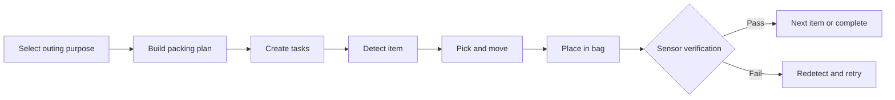

# CARE-PACK Project Overview

## 1. Purpose

CARE-PACK is an assistive system that determines what a user needs for an outing, moves those items into a bag, and verifies that they were physically loaded. With SO-ARM101 as the currently available core device, the first milestone is a closed loop:

`PERCEIVE → DECIDE → ACT → VERIFY → RECOVER`

The primary success criterion is a verified physical outcome, not a successful command response.

`COMMAND_SUCCESS ≠ TASK_SUCCESS`

## 2. Intended users

- Older adults and users who need help preparing for an outing
- Users who want to reduce forgotten items
- Guardians who need remote progress and failure notifications
- Engineering and operations teams integrating robotics, vision, sensors, and apps

## 3. Core workflow

The current web application demonstrates this workflow in simulation. It is not connected to physical robots, cameras, or sensors.

## 4. Current scope

| Area | Status | Details |
|---|---|---|
| Korean control-center UI | Implemented | Dashboard, automatic job, manual control, vision, items, history |
| Job state progression | Simulated | Step-by-step execution from PLAN through VERIFY |
| Failure recovery | Simulated | One injected PICK or VERIFY failure on the first item, followed by recovery |
| SO-ARM101 commands | Simulated | HOME, SAFE, gripper open/close, STOP |
| Vision detections | Simulated | Random item, storage cell, and coordinates |
| UI items, jobs, and events | Temporary | Browser memory only; reset on reload |
| FastAPI foundation | Partially implemented | `GET /health` and DB sessions exist; business REST APIs are planned |
| PostgreSQL database | Foundation implemented | Docker, seven core tables, Alembic, seed data, and tests |
| Real vision and calibration | Planned | OpenCV, AprilTag/ArUco, camera-to-robot transform |
| Physical verification | Planned | ESP32 and bag weight sensor |
| User, schedule, weather planning | Planned | Rule-based Planning Engine first |
| Razbot delivery and disaster priority | Planned | Later expansion after the arm MVP |

## 5. Repository role

This repository contains the current CARE-PACK control-center frontend, domain models, and simulation contracts. The intended evolution is to preserve the domain boundary while replacing mock services with backend and hardware adapters.

See the [English README](../setup/README.en.md) for setup and [System Architecture](01_SYSTEM_ARCHITECTURE.md) for the complete boundary model.
