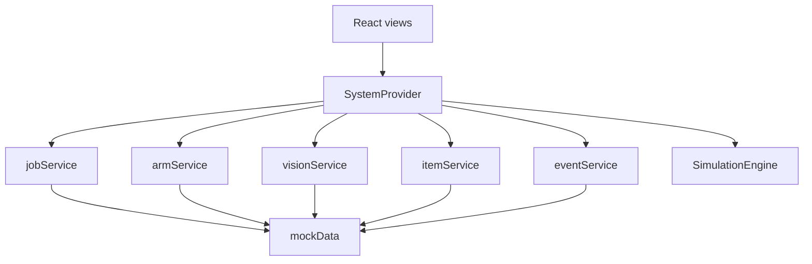
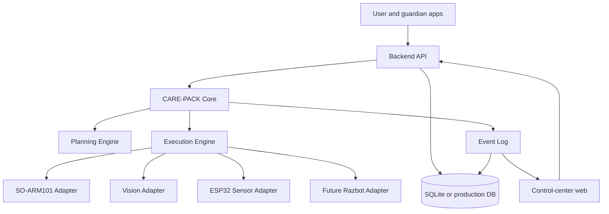

# System Architecture

## 1. Principles

- The orchestration flow is `PLAN → DISPATCH → EXECUTE → VERIFY → RECOVER → COMPLETE`.
- Robot, vision, and sensor implementations remain replaceable adapters.
- UI success and physical task success are distinct.
- Simulation and real-device modes share domain contracts.
- Safety stop takes priority over every job action.

## 2. Current architecture

All current data flows remain inside the browser process. `store/SystemProvider.tsx` owns UI state, job orchestration, events, and emergency-stop simulation. `mocks/simulationEngine.ts` provides timed steps, cancellation, and failure injection.

## 3. Target architecture

This is the planned architecture, not an implemented server topology.

## 4. Layer responsibilities

| Layer | Responsibility | Current status |
|---|---|---|
| Views | Display state and request jobs/manual commands | Implemented |
| SystemProvider | Coordinate frontend state and simulation use cases | Implemented |
| Services | Domain call boundaries and mock access | Implemented, no HTTP |
| SimulationEngine | Steps, cancellation, injected failures | Implemented |
| Backend API | Validation, persistence, authenticated orchestration | Planned |
| Execution Engine | Per-item state machine and recovery | Simulation only |
| Planning Engine | Select items from user, purpose, and weather | Planned |
| Hardware adapters | Device-specific robot, camera, and sensor integration | Planned |
| Database | Persist jobs, items, events, and device state | Planned |

## 5. Boundary contracts

- Frontend ↔ backend: versioned REST JSON; WebSocket or SSE may later provide live updates.
- Core ↔ robot: command ID, job ID, timeout, parameters, and result code.
- Core ↔ vision: item ID, coordinate frame, pose, confidence, calibration version, and capture time.
- Core ↔ sensor: sensor ID, value, unit, quality, and sample time.
- Cross-system tracing: `jobId`, `itemId`, and `eventCode`.

Details are in [Backend API Specification](03_BACKEND_API_SPEC.md), [SO-ARM101 Interface](06_SO_ARM101_INTERFACE.md), and [Event Log Specification](09_EVENT_LOG_SPEC.md).

## 6. Safety boundary

The current emergency stop cancels the simulation and changes the UI state to `ERROR`. A physical deployment must also enforce a hardware E-stop, controller-level stop, motion limits, collision controls, timeouts, and safe reset conditions. The browser button alone is not a safety mechanism.

