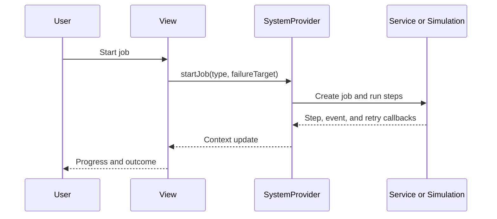

# Frontend Structure

## 1. Actual stack

| Area | Technology in this repository |
|---|---|
| UI | React 19 and TypeScript |
| Application structure | vinext with an App Router-style entry |
| Build/dev server | Vite 7 and vinext |
| Styling | Tailwind CSS 4 and global CSS |
| State | React Context through `SystemProvider` |
| Data | Service modules backed by in-memory mocks |

React Router, Zustand, Axios, and a backend SDK are not current dependencies.

## 2. Important paths

| Path | Responsibility |
|---|---|
| `frontend/app/page.tsx` | Single page entry rendering `ControlCenter` |
| `frontend/app/layout.tsx` | Root layout and metadata |
| `frontend/components/ControlCenter.tsx` | Navigation shell and view selection |
| `frontend/components/ui.tsx` | Shared cards, badges, buttons, and UI elements |
| `frontend/store/SystemProvider.tsx` | Global state and use-case orchestration |
| `frontend/types/index.ts` | Domain types and enums |
| `frontend/services/*.ts` | Device/job/item/event service boundaries |
| `frontend/mocks/mockData.ts` | Initial simulation data |
| `frontend/mocks/simulationEngine.ts` | Timed execution and failure injection |
| `frontend/views/*.tsx` | Feature views |

## 3. Views

| View | `PageKey` | Current behavior | Limitation |
|---|---|---|---|
| Dashboard | `dashboard` | Devices, active job, state flow, events | Simulated data |
| Automatic | `automatic` | PACK/SORT, failure injection, stop | No physical execution |
| Manual | `manual` | HOME, SAFE, gripper, STOP | Mock results only |
| Vision | `vision` | 3×3 storage grid and detections | Random mock detection |
| Items | `items` | Add, edit, delete, enable | Memory only; search input is not wired |
| History | `history` | Job summary/list/detail | Detail timeline is synthesized; export is pending |

## 4. Navigation

The project does not use URL-based routing. `currentPage` in `SystemProvider` changes, and `ControlCenter` conditionally renders a view. All views therefore use `/`; refreshing returns to the dashboard. Real App Router routes are recommended when shareable URLs, history navigation, or route-level authorization are required.

## 5. Data flow

## 6. Real-integration change points

Views should continue to avoid direct hardware calls. Replace `frontend/services/*.ts` with HTTP/live clients and let `SystemProvider` consume the same domain types. Once a backend exists, server state, version, and timestamps must be authoritative.

Recommended follow-up work includes an API client and environment-based URL, explicit timeout/reconnection models, real routes and authorization, state-transition tests, working item search, and history export.

