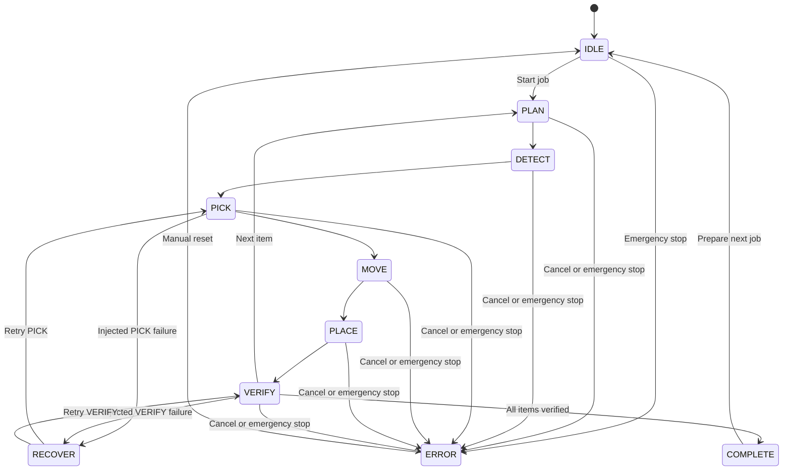

# State Machine

## 1. Execution states

`types/index.ts` defines:

`IDLE`, `PLAN`, `DETECT`, `PICK`, `MOVE`, `PLACE`, `VERIFY`, `RECOVER`, `COMPLETE`, `ERROR`

## 2. Current simulation behavior

For every item, `mocks/simulationEngine.ts` runs `PLAN → DETECT → PICK → MOVE → PLACE → VERIFY`. DETECT, PICK, and MOVE take about 1.1 seconds; other steps take about 0.75 seconds. After all items finish, `store/SystemProvider.tsx` sets `COMPLETE`.

| State | Current meaning | Exit condition |
|---|---|---|
| IDLE | No active execution | Start request |
| PLAN | Prepare item execution | Simulated delay |
| DETECT | Detect target item | Mock detection complete |
| PICK | Pick item | Mock arm step complete |
| MOVE | Move to destination | Mock movement complete |
| PLACE | Release item | Mock place complete |
| VERIFY | Verify loading result | Mock verification complete |
| RECOVER | Run failure-specific recovery | Retry prepared |
| COMPLETE | All items succeeded | Retained until next job |
| ERROR | Cancelled or emergency-stopped | Operator reset |

## 3. Job status is separate

`JobStatus` describes the job lifecycle: `WAITING`, `RUNNING`, `SUCCESS`, `FAILED`, and `CANCELLED`. The `FAILED` type exists, but the current execution path does not produce it. Cancellation and caught errors become `CANCELLED`. A backend must distinguish user cancellation, safety stop, device failure, and exhausted retries.

## 4. Recovery transition

Failure injection affects PICK or VERIFY on the first item only. It fails once, enters `RECOVER`, then retries the same state once with a guaranteed success. This does not match the UI text that states a maximum of two retries and is a known correction item.

The target server state machine must own entry conditions, timeouts, retry budgets, and compensation actions. See [Failure Recovery](10_FAILURE_RECOVERY.md).

## 5. Emergency stop

The current emergency stop sets the engine cancel flag and changes system/arm state to `ERROR`; manual reset returns to `IDLE`. Physical deployment also requires controller acknowledgement, safe handling of a held object, per-device timeouts, physical safety confirmation before reset, and a default policy that does not automatically resume the interrupted job.

