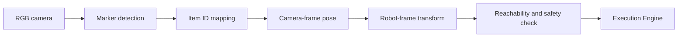

# Vision System Design

## 1. Current status

The current vision feature is a simulation implemented by `services/visionService.ts`, `mocks/mockData.ts`, and `views/VisionPage.tsx`. It does not process camera frames or include OpenCV, AprilTag/ArUco detection, or calibration.

The simulation randomly chooses an enabled item and one of `A1`, `A2`, `B1`, `B2`, `B3`, or `C2`, then generates camera-frame XYZ coordinates. The view renders the result on a 3×3 storage grid.

## 2. MVP target

Use AprilTag or ArUco markers before introducing general object detection.

| Marker ID | Example item |
|---|---|
| 01 | Medication |
| 02 | Keys |
| 03 | Card |
| 04 | Mask |
| 05 | Hand warmer |



## 3. Coordinate frames

- `camera_optical`: camera optical frame
- `robot_base`: SO-ARM101 base frame
- `storage_grid`: logical A1–C3 cells
- `bag_frame`: docked-bag reference frame

The transform uses calibration matrix `T_robot_base_camera`:

`P_robot = T_robot_base_camera × P_camera`

Recalibrate after moving the camera or robot and record calibration version and time. The MVP should fix the camera, storage unit, and bag dock to reduce uncertainty.

## 4. Target detection contract

```json
{
  "detectionId":"det-001",
  "itemId":"item-medication",
  "markerId":"01",
  "found":true,
  "confidence":0.98,
  "gridPosition":"A1",
  "cameraPose":{"x":0.12,"y":-0.04,"z":0.58,"unit":"m"},
  "robotPose":{"x":0.31,"y":0.10,"z":0.08,"unit":"m"},
  "calibrationVersion":"cal-001",
  "capturedAt":"2026-08-28T03:01:00Z"
}
```

The current TypeScript `DetectionResult` contains only a subset of these fields. This is the target contract for backend and vision modules.

## 5. Quality rules

- No marker: `ITEM_NOT_FOUND`
- Multiple candidates: use marker ID and expected location to disambiguate.
- Low confidence or excessive pose error: do not move; capture again.
- Pose outside the allowed workspace: `OUT_OF_WORKSPACE`
- Missing or stale calibration: `CALIBRATION_REQUIRED`
- Stale camera frame: discard the result.

## 6. Incremental rollout

1. Fixed RGB camera and marker ID detection
2. Camera intrinsic calibration
3. Camera-to-robot extrinsic calibration
4. Per-location approach pose and grasp offsets
5. Repeated marker-based pick-and-place accuracy tests
6. Optional YOLO-style object detection as a secondary signal

Physical verification and robot-pose validation remain mandatory even after general object detection is introduced.

