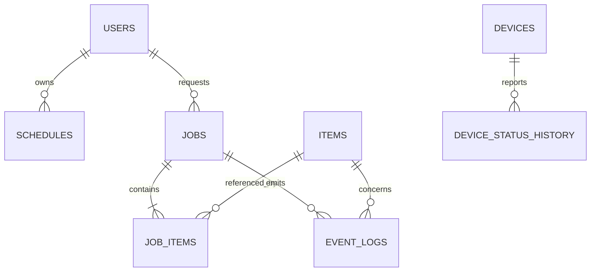

# Database Schema

## 1. Current status

Current data exists only in `mocks/mockData.ts` and React memory and resets on reload. No database or migrations are implemented. The following is a **planned schema** for an initial SQLite backend.

## 2. Relationship overview

## 3. Conventions

- Use string UUIDs or sortable unique IDs.
- Store timestamps in UTC.
- Keep application enums aligned with DB constraints.
- Treat event records as append-only.
- Minimize personal data and define authorization and retention.

## 4. Tables

### `users`

| Column | Type | Constraint/meaning |
|---|---|---|
| id | TEXT | PK |
| display_name | TEXT | NOT NULL |
| role | TEXT | `USER`, `GUARDIAN`, `OPERATOR`, `ADMIN` |
| locale | TEXT | Default `ko-KR` |
| accessibility_profile_json | TEXT | Optional JSON |
| created_at | TEXT | NOT NULL |
| updated_at | TEXT | NOT NULL |

### `items`

| Column | Type | Constraint/meaning |
|---|---|---|
| id | TEXT | PK |
| name | TEXT | NOT NULL |
| category | TEXT | NOT NULL |
| marker_id | TEXT | UNIQUE, optional |
| storage_location | TEXT | Example: `A1` |
| default_destination | TEXT | Example: `outing-bag` |
| grasp_profile_json | TEXT | Approach and grasp settings |
| enabled | INTEGER | 0/1 |
| created_at | TEXT | NOT NULL |
| updated_at | TEXT | NOT NULL |

### `schedules`

| Column | Type | Constraint/meaning |
|---|---|---|
| id | TEXT | PK |
| user_id | TEXT | FK → users.id |
| purpose | TEXT | Hospital, walk, etc. |
| starts_at | TEXT | NOT NULL |
| destination | TEXT | Optional |
| weather_context_json | TEXT | Weather snapshot used for planning |
| status | TEXT | `PLANNED`, `ACTIVE`, `DONE`, `CANCELLED` |
| created_at | TEXT | NOT NULL |
| updated_at | TEXT | NOT NULL |

### `jobs`

| Column | Type | Constraint/meaning |
|---|---|---|
| id | TEXT | PK |
| request_id | TEXT | UNIQUE idempotency key |
| user_id | TEXT | Optional FK → users.id |
| schedule_id | TEXT | Optional FK → schedules.id |
| type | TEXT | `PACK`, `SORT` |
| status | TEXT | `WAITING`, `RUNNING`, `SUCCESS`, `FAILED`, `CANCELLED` |
| execution_state | TEXT | State-machine value |
| destination | TEXT | Target location |
| progress | INTEGER | 0–100 |
| retry_count | INTEGER | Default 0 |
| error_code | TEXT | Optional final error |
| started_at | TEXT | Optional |
| completed_at | TEXT | Optional |
| created_at | TEXT | NOT NULL |
| updated_at | TEXT | NOT NULL |

### `job_items`

| Column | Type | Constraint/meaning |
|---|---|---|
| id | TEXT | PK |
| job_id | TEXT | FK → jobs.id |
| item_id | TEXT | FK → items.id |
| sequence_no | INTEGER | Order within the job |
| source_location | TEXT | Source |
| destination | TEXT | Target |
| status | TEXT | `WAITING`, `RUNNING`, `SUCCESS`, `FAILED`, `SKIPPED` |
| execution_state | TEXT | Current item step |
| retry_count | INTEGER | Default 0 |
| verification_json | TEXT | Sensor and vision evidence |
| error_code | TEXT | Optional |
| started_at | TEXT | Optional |
| completed_at | TEXT | Optional |

Use `UNIQUE(job_id, sequence_no)`.

### `event_logs`

| Column | Type | Constraint/meaning |
|---|---|---|
| id | TEXT | PK |
| occurred_at | TEXT | NOT NULL, indexed |
| level | TEXT | `INFO`, `SUCCESS`, `WARNING`, `ERROR` |
| source | TEXT | `SYSTEM`, `VISION`, `ARM`, `ESP32`, `RAZBOT` |
| event_code | TEXT | NOT NULL, indexed |
| message | TEXT | Operator-facing text |
| job_id | TEXT | Optional FK, indexed |
| item_id | TEXT | Optional FK |
| command_id | TEXT | Optional |
| metadata_json | TEXT | Structured details |

### `devices`

| Column | Type | Constraint/meaning |
|---|---|---|
| id | TEXT | PK |
| type | TEXT | `ARM`, `VISION`, `ESP32`, `RAZBOT` |
| name | TEXT | NOT NULL |
| adapter_version | TEXT | Optional |
| enabled | INTEGER | 0/1 |
| config_json | TEXT | Non-secret configuration |

### `device_status_history`

| Column | Type | Constraint/meaning |
|---|---|---|
| id | TEXT | PK |
| device_id | TEXT | FK → devices.id |
| status | TEXT | `ONLINE`, `OFFLINE`, `BUSY`, `ERROR` |
| detail_json | TEXT | Error or measurement details |
| observed_at | TEXT | NOT NULL, indexed |

## 5. Integrity and retention

- Disable rather than physically delete items referenced by active jobs.
- Update final job and job-item states in one transaction.
- Buffer event writes so a logging failure does not compromise control safety.
- Evaluate SQLite WAL mode and a single-writer policy for the MVP.
- If images are retained, use separate object storage with access and retention controls.

## 6. Migration order

1. items, jobs, job_items, event_logs
2. devices and status history
3. users and schedules
4. sensor measurement and calibration-version tables
5. Migrate to PostgreSQL or another operational DB when concurrency requires it

