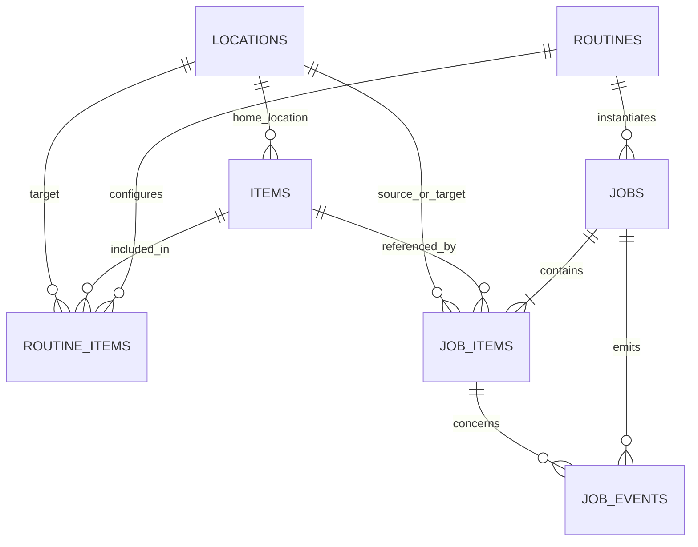

# PostgreSQL Database Structure

## 1. Implementation status

The repository now includes a PostgreSQL 17 development database, SQLAlchemy 2 models, Alembic migrations, an explicit development seed command, and database tests under `backend/`. Frontend `frontend/services/*.ts` still use React in-memory mocks and do not call this backend yet.

Exactly seven application tables are implemented:

```text
locations
items
routines
routine_items
jobs
job_items
job_events
```

Alembic's internal `alembic_version` table is not an application table.

## 2. Relationships



## 3. Shared rules

- Primary keys use PostgreSQL `UUID`.
- Timestamps use timezone-aware `TIMESTAMPTZ` values.
- Variable structured data uses `JSONB`.
- Python enums and database `CHECK` constraints enforce status values.
- Master and execution tables contain `created_at` and `updated_at` where appropriate.
- Retry counts cannot be negative and processing sequences must be positive.
- Master records should normally be deactivated with `is_active=false`, not deleted.

## 4. Tables

### `locations`

Stores source locations, destinations, optional grid cells, and robot coordinates. `code` and `name` are unique and non-empty. Robot coordinates are nullable and `is_active` defaults to true.

### `items`

Maps AprilTag identifiers to physical items. `tag_id` is unique. An item stores only its normal `home_location_id`; routine-specific and actual execution destinations are not stored permanently on the item.

### `routines` and `routine_items`

`routines` stores reusable definitions such as `OUTING_PREP` and `RETURN_HOME`. `routine_items` assigns items, destinations, positive processing order, and required flags.

- The same item cannot appear twice in one routine.
- Processing sequence numbers are unique within a routine and must be positive.
- Deleting a routine cascades only to its configuration rows.
- Referenced items and target locations use restrictive deletion.

### `jobs`

Represents one routine execution. Modes are `SIMULATION` and `REAL`; statuses are `WAITING`, `RUNNING`, `SUCCESS`, `FAILED`, and `STOPPED`.

Execution steps are `IDLE`, `PLAN`, `DETECT`, `PICK`, `MOVE`, `PLACE`, `VERIFY`, `RECOVER`, `COMPLETE`, and `ERROR`. Routine code and name snapshots preserve the original execution context after master-data changes.

### `job_items`

Stores per-item execution results, actual source and destination references, retry state, and timestamps. Item/tag and location code/name snapshots preserve history after master records are renamed or removed. Master foreign keys use `SET NULL`; snapshots remain intact. Job deletion is restricted when item history exists.

### `job_events`

Append-only events record state transitions, device results, verification, errors, emergency stops, and retries. Indexes support `job_id`, `job_item_id`, `event_type`, `created_at`, and chronological per-job queries. Item-level events must also identify their job, and the service layer verifies that the job and item belong together.

## 5. Deletion and history policy

- Only routine configuration rows cascade with their parent routine.
- Deleting a routine sets historical `jobs.routine_id` to null while snapshots remain.
- Deleting item or location masters sets historical foreign keys to null while snapshots remain.
- No broad cascade is used across `jobs`, `job_items`, and `job_events`.
- Database constraints reject accidental deletion of a job that still owns item or event history.

## 6. Development seed

Development and simulation data is inserted only by the explicit `python -m backend.app.seed` command. It is never inserted automatically on application startup. The seed resolves references by stable codes and tags and can run repeatedly without duplicates. It contains five locations, five items, two routines, and eight routine-item assignments.

## 7. Storage boundaries

Persist meaningful evidence such as job lifecycle events, final detection results, PICK/PLACE/VERIFY outcomes, failures, retries, and emergency stops. Keep camera frames, continuous joint coordinates, high-frequency sensor readings, WebSocket state, UI state, and animation state in memory or real-time channels. Store large media externally and persist only a relative path or URL.

## 8. Not implemented yet

- `/api/v1` CRUD routes for items, routines, and jobs
- Frontend integration with the backend API
- Authentication, authorization, and production backup policy
- Robot, vision, and sensor event integration

FastAPI currently exposes only `GET /health` for database connectivity.
