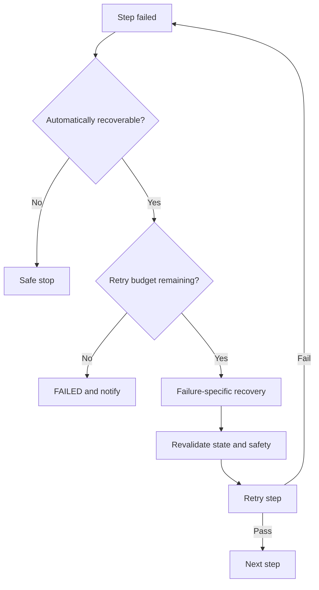

# Failure Recovery

## 1. Goal

CARE-PACK must not mark a task complete merely because a command returned success. Detection, pick, movement, placement, and verification failures must be distinguished and recovered only when it is safe.

## 2. Current scope

The web simulation injects one PICK or VERIFY failure on the first item, enters `RECOVER`, and succeeds after retrying the same state once. Planned extensions cover physical sensor decisions, accumulated failure history, exhausted-retry failure, and user notifications.

## 3. Target failure classes

| Error code | Detector | Automatic recovery | Default action |
|---|---|---|---|
| `ITEM_NOT_FOUND` | Vision | Yes | Recapture with adjusted ROI/lighting |
| `MULTIPLE_CANDIDATES` | Vision | Yes | Use marker and expected location |
| `CALIBRATION_REQUIRED` | Vision/Core | No | Stop and recalibrate |
| `PICK_FAILED` | Arm/Vision | Limited | Redetect and change grasp offset |
| `PLACE_FAILED` | Sensor/Vision | Limited | Check bag pose and replace |
| `SENSOR_ERROR` | ESP32/Core | Limited | Resample or reconnect |
| `TASK_TIMEOUT` | Core | Limited | Stop robot and inspect state |
| `ARM_OFFLINE` | Arm Adapter | No | Safe stop and notify operator |
| `OUT_OF_WORKSPACE` | Arm Adapter | No | Correct pose or layout |
| `EMERGENCY_STOP` | Safety | No | Confirm physical safety before reset |

## 4. Retry policy

An initial recommendation is at most two retries per recoverable step, stored as configuration. Never automatically retry workspace violations, E-stop, collision risk, or invalid calibration. Give each attempt a unique command ID to prevent duplicate motion.

## 5. Representative procedures

### PICK failure

1. Retreat to a safe approach pose.
2. Capture a new camera frame.
3. Recompute item pose and workspace validity.
4. Choose the next grasp profile or offset.
5. Retry PICK and verify with gripper/vision signals.

### VERIFY failure

1. Confirm PLACE completion and robot retreat.
2. Resample bag weight over a defined window.
3. Check whether vision shows the item still in the gripper.
4. If placement failed, regrasp and replace.
5. If the sensor itself is faulty, stop without moving the item blindly.

## 6. Final failure handling

- Mark the job item and job `FAILED`.
- Record the last safe pose or STOP result.
- Log the failure code, attempt count, and detection/command/sensor references.
- Notify the user with item name and required manual action.
- Do not automatically start another job before operator review.
- Let planning policy decide whether an optional-item failure may be skipped; a required-item failure should normally stop completion.

## 7. Verification criteria

- Automated tests confirm every expected failure transition.
- Retry counts match emitted events.
- No new robot commands are sent after cancel or E-stop.
- Failure state is restored after client reconnect.
- Replayed requests never duplicate a physical action.
