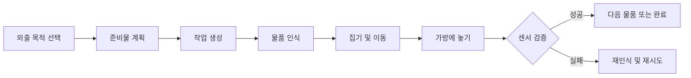

# CARE-PACK 프로젝트 개요

## 1. 프로젝트 목적

CARE-PACK은 사용자의 외출 목적과 상황을 바탕으로 필요한 물품을 정하고, 로봇이 물품을 가방으로 옮긴 뒤 실제 적재 여부까지 확인하는 생활 보조 시스템이다. 현재 보유 장비인 SO-ARM101을 중심으로 다음 폐루프를 먼저 완성하는 것이 1차 목표다.

`인지 → 판단 → 로봇 동작 → 결과 검증 → 실패 복구`

핵심 성공 조건은 명령 전송이 아니라 물리적 결과의 확인이다.

`COMMAND_SUCCESS ≠ TASK_SUCCESS`

## 2. 대상 사용자

- 외출 준비에 도움이 필요한 고령자 또는 거동이 불편한 사용자
- 준비물 누락을 줄이려는 일반 사용자
- 원격으로 준비 상태와 실패 알림을 확인하는 보호자
- 로봇, 비전, 센서, 앱을 통합하는 개발·운영 팀

## 3. 핵심 사용자 흐름

현재 웹에서는 이 흐름을 시뮬레이션으로 체험할 수 있다. 실제 로봇·카메라·센서는 연결되어 있지 않다.

## 4. 현재 구현 범위

| 구분 | 상태 | 내용 |
|---|---|---|
| 한국어 운영 화면 | 구현됨 | 대시보드, 자동 작업, 수동 제어, 비전, 물품, 이력 |
| 작업 상태 전이 | 시뮬레이션 | PLAN부터 VERIFY까지 단계별 진행 |
| 실패 복구 | 시뮬레이션 | 첫 물품의 PICK 또는 VERIFY 실패 1회 주입 후 복구 |
| SO-ARM101 명령 | 시뮬레이션 | HOME, SAFE, 그리퍼 열기/닫기, STOP |
| 카메라 인식 | 시뮬레이션 | 임의 물품과 보관함 위치 좌표 생성 |
| 화면 물품·작업·이벤트 | 임시 구현 | 브라우저 메모리만 사용, 새로고침 시 초기화 |
| FastAPI 기반 | 일부 구현 | `GET /health`와 DB 세션 구현, 업무 REST API는 계획됨 |
| PostgreSQL 데이터베이스 | 기반 구현 | Docker, 7개 핵심 테이블, Alembic, 시드와 테스트 |
| 실제 비전/좌표 보정 | 계획됨 | OpenCV, AprilTag/ArUco, 카메라-로봇 좌표 변환 |
| 물리 센서 검증 | 계획됨 | ESP32 및 가방 무게 센서 연동 |
| 사용자·일정·날씨 계획 엔진 | 계획됨 | 규칙 기반 Planning Engine부터 구현 예정 |
| 라즈봇 배송·재난 우선 모드 | 계획됨 | 1차 MVP 이후 확장 |

## 5. 저장소의 역할

이 저장소는 현재 CARE-PACK 제어센터의 프론트엔드 프로토타입과 시뮬레이션 계약을 담고 있다. UI와 도메인 모델을 실제 시스템의 기준 계약으로 발전시키되, 하드웨어 상세를 화면 코드에 직접 결합하지 않는 구조를 지향한다.

실행 방법은 [한국어 README](../../README.ko.md), 전체 시스템 구조는 [시스템 아키텍처](01_SYSTEM_ARCHITECTURE.md)를 참고한다.
