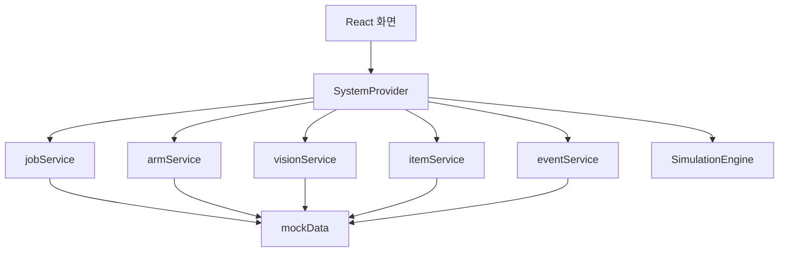
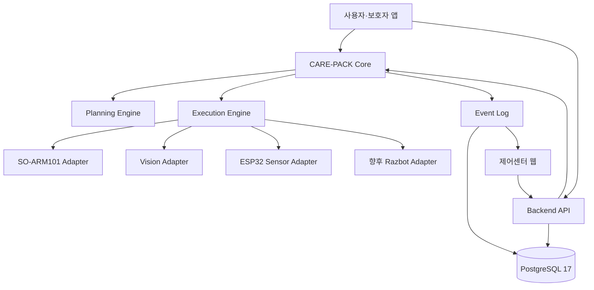

# 시스템 아키텍처

## 1. 아키텍처 원칙

- 상위 시스템은 `PLAN → DISPATCH → EXECUTE → VERIFY → RECOVER → COMPLETE`를 책임진다.
- 로봇 제어, 비전, 센서 구현은 교체 가능한 어댑터로 분리한다.
- UI의 성공 표시와 물리적 작업 성공을 구분한다.
- 시뮬레이션과 실장비 모드는 같은 도메인 계약을 사용한다.
- 안전 정지는 모든 작업보다 우선한다.

## 2. 현재 구현 아키텍처

현재 데이터 흐름은 모두 브라우저 프로세스 안에서 끝난다. `store/SystemProvider.tsx`가 화면 상태, 작업 실행, 이벤트, 비상정지를 중앙 관리하고 `mocks/simulationEngine.ts`가 시간 지연과 실패 주입을 수행한다.

## 3. 목표 아키텍처

DB 계층과 FastAPI 상태 확인을 제공하며, 업무 API·Core·장치 어댑터 연결은 아래 목표 구조에 따라 확장할 계획이다.

## 4. 계층별 책임

| 계층 | 책임 | 현재 상태 |
|---|---|---|
| 화면 | 상태 표시, 작업 요청, 수동 명령, 이력 조회 | 구현됨 |
| SystemProvider | 화면 상태와 시뮬레이션 유스케이스 조정 | 구현됨 |
| 서비스 | 도메인별 호출 계약과 mock 접근 | 구현됨, HTTP 미연결 |
| SimulationEngine | 단계 진행, 취소, 실패 주입 | 구현됨 |
| Backend API | 인증, 검증, 영속화, 하드웨어 요청 조정 | 계획됨 |
| Execution Engine | 물품별 상태기계 실행과 복구 | 시뮬레이션만 구현 |
| Planning Engine | 사용자·목적·날씨 기반 준비물 결정 | 계획됨 |
| 하드웨어 어댑터 | 로봇·카메라·센서의 장치별 구현 | 계획됨 |
| 데이터베이스 | 작업, 물품, 이벤트, 장치 상태 영속화 | 계획됨 |

## 5. 주요 경계 계약

- 프론트엔드 ↔ 백엔드: REST JSON, 실시간 갱신은 향후 WebSocket 또는 SSE 검토
- Core ↔ 로봇: 명령 ID, 작업 ID, 제한 시간, 결과 코드가 포함된 명령 계약
- Core ↔ 비전: 물품 ID, 좌표계, 자세, 신뢰도, 프레임 시간
- Core ↔ 센서: 센서 ID, 측정값, 단위, 품질, 측정 시간
- 모든 계층 ↔ 이벤트: 추적 가능한 `jobId`, `itemId`, `eventCode`

구체 계약은 [백엔드 API 명세](03_BACKEND_API_SPEC.md), [SO-ARM101 인터페이스](06_SO_ARM101_INTERFACE.md), [이벤트 로그 명세](09_EVENT_LOG_SPEC.md)를 따른다.

## 6. 안전 및 장애 격리

비상정지는 진행 중인 실행을 취소하고 시스템을 `ERROR`로 전환한다. 실제 하드웨어 단계에서는 UI 버튼만으로 안전을 보장하지 않으며, 물리 E-stop, 통신 타임아웃, 속도·토크 제한, 안전 영역을 로봇 컨트롤러와 하드웨어 계층에서 강제해야 한다.
