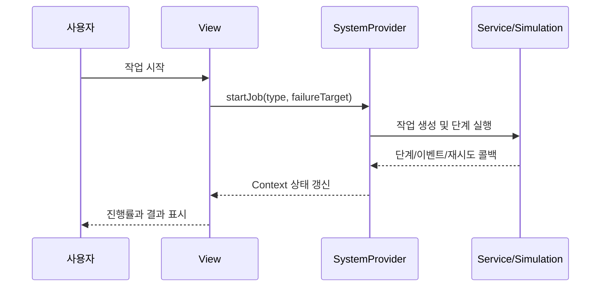

# 프론트엔드 구조

## 1. 기술 스택

| 항목 | 실제 사용 |
|---|---|
| UI | React 19, TypeScript |
| 앱 구조 | vinext 기반 App Router 형식 |
| 빌드/개발 서버 | Vite 7 + vinext |
| 스타일 | Tailwind CSS 4, 전역 CSS |
| 상태 관리 | React Context (`SystemProvider`) |
| 데이터 | 서비스 계층 + 메모리 mock |

React Router, Zustand, Axios는 현재 의존성에 없다.

## 2. 주요 파일

| 경로 | 역할 |
|---|---|
| `frontend/app/page.tsx` | 단일 진입 화면, `ControlCenter` 렌더링 |
| `frontend/app/layout.tsx` | 루트 레이아웃과 메타데이터 |
| `frontend/components/ControlCenter.tsx` | 사이드바, 상단 상태, 페이지 선택 |
| `frontend/components/ui.tsx` | 공통 배지·카드·버튼 등 |
| `frontend/store/SystemProvider.tsx` | 전역 상태와 실행 유스케이스 |
| `frontend/types/index.ts` | 도메인 타입과 enum |
| `frontend/services/*.ts` | 장치·작업·물품·이벤트 접근 경계 |
| `frontend/mocks/mockData.ts` | 초기 시뮬레이션 데이터 |
| `frontend/mocks/simulationEngine.ts` | 작업 단계 진행과 실패 주입 |
| `frontend/views/*.tsx` | 기능별 화면 |

## 3. 화면과 기능

| 화면 | `PageKey` | 기능 | 제한 |
|---|---|---|---|
| 대시보드 | `dashboard` | 장치, 현재 작업, 상태 흐름, 최근 이벤트 | 모두 시뮬레이션 상태 |
| 자동 작업 | `automatic` | PACK/SORT 작업 생성, 실패 주입, 중지 | 실제 장치 미연결 |
| 수동 제어 | `manual` | HOME, SAFE, 그리퍼, STOP | mock 응답만 제공 |
| 비전 | `vision` | 3×3 보관함과 인식 좌표 표시 | 무작위 모의 인식 |
| 물품 관리 | `items` | 추가·수정·삭제·활성화 | 메모리 저장, 검색 입력 미연결 |
| 작업 이력 | `history` | 요약, 작업 목록, 상세 표시 | 합성 데이터 기반 상세 타임라인, 내보내기는 확장 계획 |

## 4. 라우팅 방식

현재 URL 라우팅 라이브러리를 사용하지 않는다. `SystemProvider`의 `currentPage` 상태를 바꾸고 `ControlCenter`가 조건부로 화면을 렌더링한다. 따라서 모든 화면은 `/` 하나에서 동작하며 새로고침 시 대시보드로 돌아간다.

향후 URL 공유, 뒤로 가기, 권한별 경로가 필요하면 App Router의 실제 라우트로 분리한다.

## 5. 상태와 데이터 흐름

## 6. 실제 연동 시 변경 지점

화면 컴포넌트가 하드웨어를 직접 호출하지 않도록 유지한다. `frontend/services/*.ts`를 HTTP/실시간 클라이언트로 교체하고 `SystemProvider`는 같은 도메인 타입을 소비하도록 한다. 서버 상태가 기준이 되면 낙관적 UI보다 서버가 반환한 상태·버전·타임스탬프를 우선한다.

권장 추가 작업:

1. API client와 환경 변수 기반 base URL 도입
2. 서버 오류·타임아웃·재연결 상태 모델링
3. 실제 라우트 및 권한 보호
4. 테스트 도구와 주요 상태 전이 테스트 추가
5. 물품 검색 및 이력 내보내기 구현
