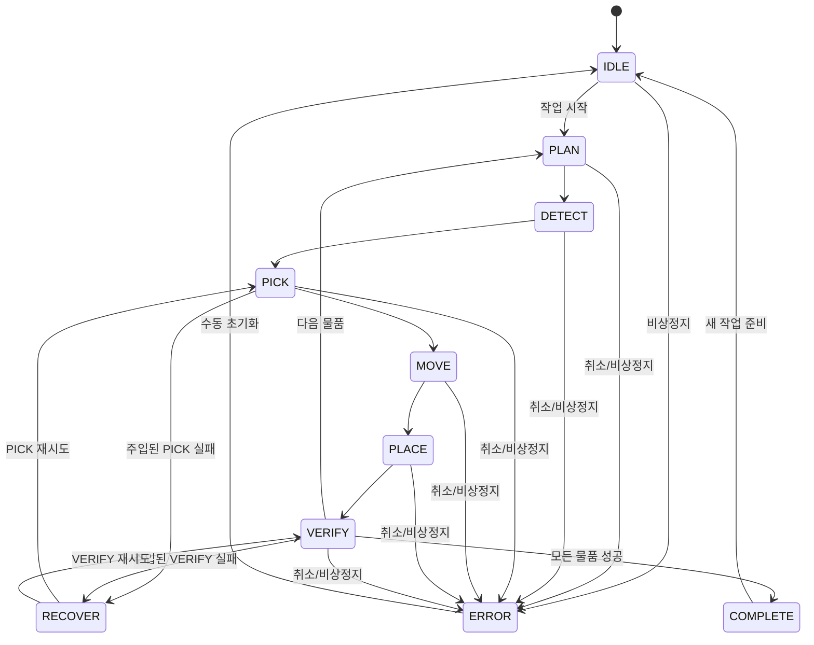

# 상태기계

## 1. 실행 상태

`types/index.ts`의 `ExecutionState`는 다음 상태를 정의한다.

`IDLE`, `PLAN`, `DETECT`, `PICK`, `MOVE`, `PLACE`, `VERIFY`, `RECOVER`, `COMPLETE`, `ERROR`

## 2. 현재 시뮬레이션 동작

`mocks/simulationEngine.ts`는 각 물품마다 `PLAN → DETECT → PICK → MOVE → PLACE → VERIFY`를 실행한다. 상태 지연은 DETECT/PICK/MOVE가 약 1.1초, 나머지가 약 0.75초다. 모든 물품 실행이 끝나면 `store/SystemProvider.tsx`가 최종 `COMPLETE`를 설정한다.

| 상태 | 현재 의미 | 완료 조건 |
|---|---|---|
| IDLE | 실행 작업 없음 | 작업 시작 요청 |
| PLAN | 물품별 실행 준비 | 시뮬레이션 지연 완료 |
| DETECT | 물품 인식 단계 | 모의 인식 완료 |
| PICK | 집기 단계 | 모의 로봇 단계 완료 |
| MOVE | 목적지 이동 | 모의 이동 완료 |
| PLACE | 내려놓기 | 모의 놓기 완료 |
| VERIFY | 적재 결과 확인 | 모의 검증 완료 |
| RECOVER | 실패 원인 복구 | 동일 단계 재시도 준비 |
| COMPLETE | 모든 물품 성공 | 다음 작업 전까지 유지 |
| ERROR | 취소 또는 비상정지 | 운영자 초기화 |

## 3. 작업 상태와의 구분

실행 상태는 현재 단계를 나타내고 `JobStatus`는 작업의 수명주기를 나타낸다.

- `WAITING`: 생성되었으나 실행 전
- `RUNNING`: 하나 이상의 단계 실행 중
- `SUCCESS`: 모든 물품 처리 완료
- `FAILED`: 타입에는 있으나 현재 시뮬레이션 실행 경로에서 생성되지 않음
- `CANCELLED`: 중지 또는 오류 catch 경로

현재는 예외가 발생해도 작업이 `FAILED`가 아니라 `CANCELLED`로 기록된다. 실제 백엔드에서는 사용자 취소, 안전 정지, 장치 실패, 재시도 소진을 분리해야 한다.

## 4. 복구 전이

현재 실패 주입은 첫 번째 물품의 `PICK` 또는 `VERIFY`에서 한 번만 발생하며, `RECOVER` 후 같은 단계를 한 번 재실행하면 항상 성공한다. 자동 재시도 횟수가 2회라는 화면 문구와 실제 엔진 동작이 일치하지 않는 점은 수정 대상이다.

목표 구현에서는 상태별 진입 조건, 제한 시간, 재시도 예산, 보상 동작을 서버가 소유해야 한다. 자세한 정책은 [실패 복구](10_FAILURE_RECOVERY.md)를 참고한다.

## 5. 비상정지

비상정지는 현재 엔진 취소 플래그를 설정하고 시스템과 로봇 상태를 `ERROR`로 변경한다. 수동 초기화는 다시 `IDLE`로 전환한다. 실장비에서는 다음 조건이 추가되어야 한다.

- 로봇 컨트롤러 자체의 정지 확인
- 그리퍼에 물체가 있는 경우의 안전 자세 결정
- 장치별 ACK와 타임아웃
- 운영자 원인 확인 및 물리적 안전 확인 후 reset
- 중단 작업을 자동 재개하지 않는 기본 정책

