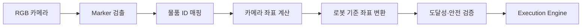

# 비전 시스템 설계

## 1. 현재 상태

현재 비전 기능은 `services/visionService.ts`, `mocks/mockData.ts`, `views/VisionPage.tsx`로 구성된 시뮬레이션이다. 실제 카메라 프레임, OpenCV, AprilTag/ArUco 검출, 카메라 보정은 포함되어 있지 않다.

시뮬레이션은 활성 물품 하나와 `A1`, `A2`, `B1`, `B2`, `B3`, `C2` 중 하나를 임의로 선택하고 카메라 기준 XYZ 좌표를 생성한다. 화면은 3×3 보관함 그리드와 인식 결과를 표시한다.

## 2. 1차 MVP 목표

복잡한 일반 객체 탐지보다 각 물품에 AprilTag 또는 ArUco marker를 부착한다.

| marker ID | 물품 예시 |
|---|---|
| 01 | 약통 |
| 02 | 차키 |
| 03 | 카드 |
| 04 | 마스크 |
| 05 | 핫팩 |



## 3. 좌표계

- `camera_optical`: 카메라 광학 좌표계
- `robot_base`: SO-ARM101 베이스 좌표계
- `storage_grid`: A1~C3 보관함 논리 좌표
- `bag_frame`: 도킹된 가방의 기준 좌표계

좌표 변환은 보정 행렬 `T_robot_base_camera`를 사용한다.

`P_robot = T_robot_base_camera × P_camera`

카메라 또는 로봇 위치가 바뀌면 보정을 다시 수행하고 보정 버전과 시간을 기록해야 한다. MVP에서는 카메라, 보관함, 가방 도킹 위치를 고정하여 오차 요인을 줄인다.

## 4. 인식 결과 계약

```json
{
  "detectionId": "det-001",
  "itemId": "item-medication",
  "markerId": "01",
  "found": true,
  "confidence": 0.98,
  "gridPosition": "A1",
  "cameraPose": {"x": 0.12, "y": -0.04, "z": 0.58, "unit": "m"},
  "robotPose": {"x": 0.31, "y": 0.10, "z": 0.08, "unit": "m"},
  "calibrationVersion": "cal-001",
  "capturedAt": "2026-08-28T03:01:00Z"
}
```

현재 TypeScript `DetectionResult`는 이 중 일부 필드만 가진다. 위 계약은 백엔드·비전 모듈을 위한 목표안이다.

## 5. 검출 품질 규칙

- marker가 없으면 `ITEM_NOT_FOUND`
- 여러 후보가 있으면 marker ID와 예상 보관 위치로 좁힌다.
- 신뢰도 또는 pose 오차가 기준을 넘으면 로봇을 움직이지 않고 재촬영한다.
- 좌표가 작업 공간 밖이면 `OUT_OF_WORKSPACE`
- 보정 정보가 없거나 만료되면 `CALIBRATION_REQUIRED`
- 프레임 시간이 오래되면 결과를 폐기한다.

## 6. 단계적 확장

1. 고정 카메라 + marker ID 인식
2. 카메라 내부 파라미터 보정
3. 카메라-로봇 외부 파라미터 보정
4. 저장 위치별 접근 자세와 파지 오프셋 등록
5. marker 기반 pick & place 반복 정확도 시험
6. YOLO 등 일반 객체 탐지를 보조 수단으로 추가

객체 탐지를 추가하더라도 최종 로봇 좌표의 유효성 검증과 물리 센서 기반 결과 검증은 유지한다.

