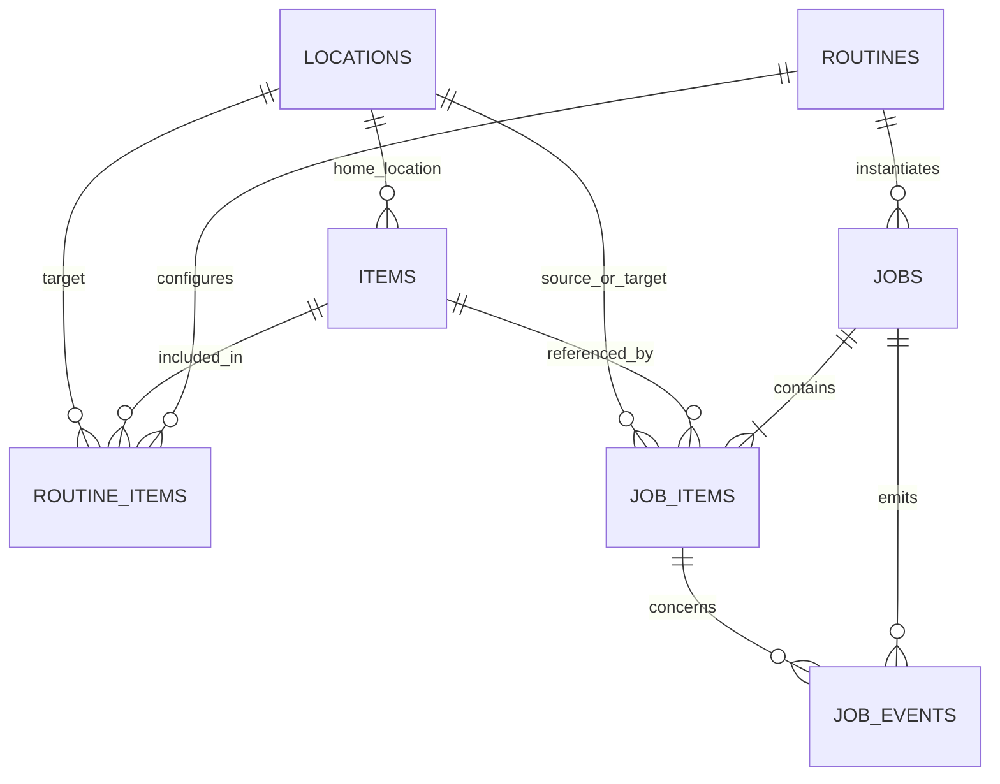

# PostgreSQL 데이터베이스 구조

## 1. 구현 상태

`backend/`는 PostgreSQL 17 개발 DB, SQLAlchemy 2 모델, Alembic 마이그레이션, 명시적 개발 시드와 DB 테스트를 제공한다. 프론트엔드 `frontend/services/*.ts`는 React 메모리 mock으로 화면 데이터를 관리하며, 백엔드 API 연결은 확장 계획에 포함된다.

구현된 핵심 테이블은 정확히 다음 일곱 개다.

```text
locations
items
routines
routine_items
jobs
job_items
job_events
```

Alembic 내부 테이블인 `alembic_version`은 애플리케이션 테이블에 포함하지 않는다.

## 2. 관계



## 3. 공통 규칙

- 기본 키는 PostgreSQL `UUID`다.
- 시간은 시간대가 있는 `TIMESTAMPTZ`로 저장한다.
- JSON 보조 정보는 `JSONB`를 사용한다.
- 상태는 Python Enum과 DB `CHECK` 제약조건을 함께 사용한다.
- `created_at`, `updated_at`을 마스터·작업 테이블에 둔다.
- 재시도 횟수는 음수가 될 수 없고 처리 순서는 양수여야 한다.
- 마스터 데이터는 삭제보다 `is_active=false` 비활성화를 우선한다.

## 4. 테이블

### `locations`

보관 위치와 목적지, 선택적 그리드·로봇 좌표를 저장한다. `code`, `name`은 각각 UNIQUE이며 빈 문자열을 허용하지 않는다. `is_active`는 기본 `true`다.

### `items`

AprilTag ID와 실제 물품을 연결한다. `tag_id`는 UNIQUE다. 영구 목적지는 두지 않고 기본 보관 위치인 `home_location_id`만 가지며, 위치 삭제 시 이 FK는 `NULL`이 된다.

### `routines`, `routine_items`

`routines`는 `OUTING_PREP`, `RETURN_HOME` 같은 재사용 계획이다. `routine_items`는 루틴별 물품, 실제 목적지, 순서와 필수 여부를 정의한다.

- 동일 루틴에 동일 물품을 중복 등록할 수 없다.
- 동일 루틴에서 처리 순서를 중복 사용할 수 없다.
- `sequence > 0`을 DB에서 강제한다.
- 루틴 삭제 시 구성 행만 `CASCADE` 삭제한다.
- 참조 중인 물품과 목적지 삭제는 `RESTRICT`한다.

### `jobs`

루틴을 한 번 실행한 기록이다. 모드는 `SIMULATION`, `REAL`, 상태는 `WAITING`, `RUNNING`, `SUCCESS`, `FAILED`, `STOPPED`를 사용한다.

현재 단계는 `IDLE`, `PLAN`, `DETECT`, `PICK`, `MOVE`, `PLACE`, `VERIFY`, `RECOVER`, `COMPLETE`, `ERROR` 중 하나다. `routine_code_snapshot`과 `routine_name_snapshot`으로 이후 루틴 이름이 변경되어도 당시 기록을 보존한다.

### `job_items`

작업 안에서 처리한 각 물품의 결과를 저장한다.

- 실제 실행 당시 출발지와 목적지를 별도로 저장한다.
- 물품 이름·태그와 출발지·목적지 이름/코드를 스냅샷으로 보존한다.
- 마스터 물품이나 위치가 삭제되면 FK는 `NULL`이지만 스냅샷은 남는다.
- 작업별 순서는 UNIQUE이고 양수다.
- 작업 삭제가 작업 물품을 자동 삭제하지 않도록 `RESTRICT`한다.

### `job_events`

상태 전이, 장치 결과, 검증, 오류, 비상정지와 재시도 기록을 append-only 이벤트로 저장한다. `job_id`, `job_item_id`, `event_type`, `created_at`과 작업별 시간순 조회에 필요한 인덱스가 있다. 작업 물품 이벤트는 반드시 작업 ID도 가져야 하며 서비스 계층은 작업과 물품 조합이 일치하는지 확인한다.

## 5. 삭제 정책과 실행 이력

- 루틴 구성만 부모 루틴과 함께 삭제할 수 있다.
- 루틴 삭제 시 기존 `jobs.routine_id`는 `NULL`이 되지만 루틴 스냅샷은 남는다.
- 물품·위치 삭제 시 기존 작업 FK는 `NULL`이 되지만 작업 물품 스냅샷은 남는다.
- `jobs`, `job_items`, `job_events` 사이에는 광범위한 삭제 cascade를 사용하지 않는다.
- 작업 물품이나 이벤트가 있는 작업을 실수로 삭제하면 DB 제약조건이 거부한다.

## 6. 개발 시드

`python -m backend.app.seed`를 명시적으로 실행할 때만 개발/시뮬레이션 데이터가 들어간다. 애플리케이션 시작 시 자동 삽입하지 않는다. 위치 5개, 물품 5개, 루틴 2개와 루틴 구성 8개를 코드·태그 기반으로 확인해 여러 번 실행해도 중복되지 않는다.

## 7. 저장 경계

DB에는 작업 시작·완료, 최종 인식 결과, PICK/PLACE/VERIFY 판정, 실패 이유, 재시도와 비상정지처럼 의미 있는 실행 증거만 저장한다. 카메라 프레임, 연속 관절 좌표, 고빈도 센서 값, WebSocket 연결과 UI 애니메이션 상태는 메모리/실시간 채널에 둔다. 이미지·영상 보존이 필요하면 외부 파일 또는 객체 저장소에 두고 DB에는 상대 경로나 URL만 기록한다.

## 8. 연동 확장 계획

- 물품·루틴·작업용 `/api/v1` CRUD 라우트
- 프론트엔드 서비스의 실제 API 연결
- 인증·권한과 운영용 백업 정책
- 로봇·비전·센서 프로세스의 이벤트 기록 연동

현재 FastAPI의 공개 엔드포인트는 DB 연결 확인용 `GET /health`다. 위 항목은 이를 기반으로 확장할 계획이다.
