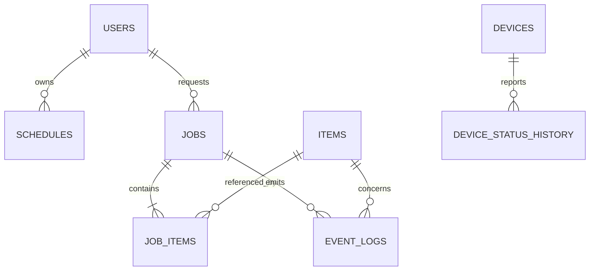

# 데이터베이스 스키마

## 1. 현재 상태

현재 데이터는 `mocks/mockData.ts`와 React 메모리에만 존재하며 새로고침하면 초기화된다. 데이터베이스와 마이그레이션은 구현되어 있지 않다. 아래는 SQLite 기반 1차 백엔드를 위한 **계획 스키마**다.

## 2. 관계 개요

## 3. 공통 규칙

- 기본 키는 문자열 UUID 또는 정렬 가능한 고유 ID를 사용한다.
- 시간은 UTC ISO 8601 또는 DB timestamp로 저장한다.
- 상태 값은 애플리케이션 enum과 DB 제약 조건을 일치시킨다.
- 이벤트는 수정하지 않는 append-only를 원칙으로 한다.
- 민감 사용자 정보는 최소 수집하고 접근 권한과 보존 기간을 정의한다.

## 4. 테이블 정의

### `users`

| 컬럼 | 형식 | 제약/설명 |
|---|---|---|
| id | TEXT | PK |
| display_name | TEXT | NOT NULL |
| role | TEXT | `USER`, `GUARDIAN`, `OPERATOR`, `ADMIN` |
| locale | TEXT | 기본 `ko-KR` |
| accessibility_profile_json | TEXT | 선택, JSON |
| created_at | TEXT | NOT NULL |
| updated_at | TEXT | NOT NULL |

### `items`

| 컬럼 | 형식 | 제약/설명 |
|---|---|---|
| id | TEXT | PK |
| name | TEXT | NOT NULL |
| category | TEXT | NOT NULL |
| marker_id | TEXT | UNIQUE, 선택 |
| storage_location | TEXT | 예: `A1` |
| default_destination | TEXT | 예: `외출 가방` |
| grasp_profile_json | TEXT | 접근·파지 설정 JSON |
| enabled | INTEGER | 0/1 |
| created_at | TEXT | NOT NULL |
| updated_at | TEXT | NOT NULL |

### `schedules`

| 컬럼 | 형식 | 제약/설명 |
|---|---|---|
| id | TEXT | PK |
| user_id | TEXT | FK → users.id |
| purpose | TEXT | 병원, 산책 등 |
| starts_at | TEXT | NOT NULL |
| destination | TEXT | 선택 |
| weather_context_json | TEXT | 계획 시점의 날씨 snapshot |
| status | TEXT | `PLANNED`, `ACTIVE`, `DONE`, `CANCELLED` |
| created_at | TEXT | NOT NULL |
| updated_at | TEXT | NOT NULL |

### `jobs`

| 컬럼 | 형식 | 제약/설명 |
|---|---|---|
| id | TEXT | PK |
| request_id | TEXT | UNIQUE, 중복 요청 방지 |
| user_id | TEXT | FK → users.id, 선택 |
| schedule_id | TEXT | FK → schedules.id, 선택 |
| type | TEXT | `PACK`, `SORT` |
| status | TEXT | `WAITING`, `RUNNING`, `SUCCESS`, `FAILED`, `CANCELLED` |
| execution_state | TEXT | 상태기계 값 |
| destination | TEXT | 목표 위치 |
| progress | INTEGER | 0~100 |
| retry_count | INTEGER | 기본 0 |
| error_code | TEXT | 최종 오류, 선택 |
| started_at | TEXT | 선택 |
| completed_at | TEXT | 선택 |
| created_at | TEXT | NOT NULL |
| updated_at | TEXT | NOT NULL |

### `job_items`

| 컬럼 | 형식 | 제약/설명 |
|---|---|---|
| id | TEXT | PK |
| job_id | TEXT | FK → jobs.id |
| item_id | TEXT | FK → items.id |
| sequence_no | INTEGER | 작업 내 순서 |
| source_location | TEXT | 출발지 |
| destination | TEXT | 목적지 |
| status | TEXT | `WAITING`, `RUNNING`, `SUCCESS`, `FAILED`, `SKIPPED` |
| execution_state | TEXT | 현재 단계 |
| retry_count | INTEGER | 기본 0 |
| verification_json | TEXT | 센서·비전 검증 결과 |
| error_code | TEXT | 선택 |
| started_at | TEXT | 선택 |
| completed_at | TEXT | 선택 |

`UNIQUE(job_id, sequence_no)` 제약을 둔다.

### `event_logs`

| 컬럼 | 형식 | 제약/설명 |
|---|---|---|
| id | TEXT | PK |
| occurred_at | TEXT | NOT NULL, 인덱스 |
| level | TEXT | `INFO`, `SUCCESS`, `WARNING`, `ERROR` |
| source | TEXT | `SYSTEM`, `VISION`, `ARM`, `ESP32`, `RAZBOT` |
| event_code | TEXT | NOT NULL, 인덱스 |
| message | TEXT | 운영자용 문구 |
| job_id | TEXT | FK → jobs.id, 선택, 인덱스 |
| item_id | TEXT | FK → items.id, 선택 |
| command_id | TEXT | 선택 |
| metadata_json | TEXT | 구조화 부가 정보 |

### `devices`

| 컬럼 | 형식 | 제약/설명 |
|---|---|---|
| id | TEXT | PK |
| type | TEXT | `ARM`, `VISION`, `ESP32`, `RAZBOT` |
| name | TEXT | NOT NULL |
| adapter_version | TEXT | 선택 |
| enabled | INTEGER | 0/1 |
| config_json | TEXT | 비밀값을 제외한 구성 |

### `device_status_history`

| 컬럼 | 형식 | 제약/설명 |
|---|---|---|
| id | TEXT | PK |
| device_id | TEXT | FK → devices.id |
| status | TEXT | `ONLINE`, `OFFLINE`, `BUSY`, `ERROR` |
| detail_json | TEXT | 오류·측정 부가 정보 |
| observed_at | TEXT | NOT NULL, 인덱스 |

## 5. 무결성과 보존

- 작업 실행 중 참조되는 물품은 물리 삭제하지 않고 비활성화한다.
- job과 job_item의 최종 상태 변경은 하나의 트랜잭션으로 처리한다.
- 이벤트 기록 실패가 제어 안전성을 막지 않도록 로컬 버퍼와 재전송 정책을 둔다.
- SQLite MVP에서는 WAL 모드와 단일 writer 규칙을 검토한다.
- 운영 단계에서 영상 원본을 저장한다면 별도 객체 저장소, 접근 통제, 보존 기간이 필요하다.

## 6. 마이그레이션 순서

1. items, jobs, job_items, event_logs
2. devices와 상태 이력
3. users와 schedules
4. 센서 측정·보정 버전 테이블
5. 운영 DB가 필요해질 때 PostgreSQL 등으로 이전

