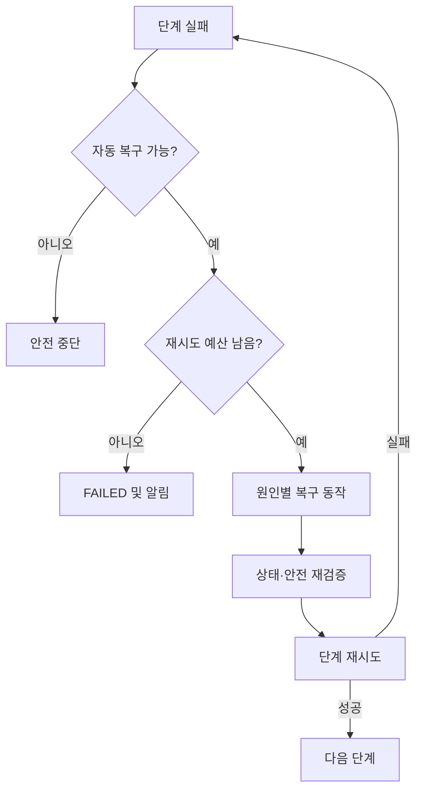

# 실패 복구

## 1. 목표

CARE-PACK은 명령 응답이 성공했다는 이유만으로 작업을 완료 처리하지 않는다. 인식, 파지, 이동, 놓기, 센서 검증 각각의 실패를 구분하고 안전한 범위에서만 자동 복구한다.

## 2. 현재 구현 범위

시뮬레이션에서 자동 복구할 수 있는 실패는 첫 물품의 `PICK` 또는 `VERIFY` 한 번뿐이다. `RECOVER` 상태 이후 동일 단계가 한 번 재실행되고 항상 성공한다. 실제 센서 판정, 실패 누적, 최종 실패, 사용자 알림은 구현되어 있지 않다.

## 3. 목표 실패 분류

| 오류 코드 | 검출 주체 | 자동 복구 | 기본 조치 |
|---|---|---|---|
| `ITEM_NOT_FOUND` | Vision | 가능 | 재촬영, 조명/ROI 변경 |
| `MULTIPLE_CANDIDATES` | Vision | 가능 | marker와 예상 위치로 재선택 |
| `CALIBRATION_REQUIRED` | Vision/Core | 불가 | 작업 중단, 재보정 |
| `PICK_FAILED` | Arm/Vision | 제한적 | 재인식, 다른 파지 오프셋 |
| `PLACE_FAILED` | Sensor/Vision | 제한적 | 가방 위치 확인, 재배치 |
| `SENSOR_ERROR` | ESP32/Core | 제한적 | 재측정, 연결 복구 |
| `TASK_TIMEOUT` | Core | 제한적 | 로봇 정지, 상태 조회 |
| `ARM_OFFLINE` | Arm Adapter | 불가 | 안전 중단, 운영자 알림 |
| `OUT_OF_WORKSPACE` | Arm Adapter | 불가 | 좌표/배치 수정 |
| `EMERGENCY_STOP` | Safety | 불가 | 물리 안전 확인 후 reset |

## 4. 재시도 정책

권장 초기값은 단계별 최대 2회 재시도이며 이는 설정값으로 관리한다. 단, 좌표 범위 위반, E-stop, 충돌 가능성, 보정 오류는 자동 재시도하지 않는다. 같은 명령의 중복 실행을 막기 위해 각 시도에 고유 command ID를 부여한다.

## 5. 대표 복구 절차

### PICK 실패

1. 로봇을 안전한 접근 자세로 후퇴한다.
2. 카메라를 다시 촬영한다.
3. 물품 pose와 작업 공간을 다시 계산한다.
4. 다음 grasp profile 또는 오프셋을 선택한다.
5. PICK 후 그리퍼/비전 신호로 재검증한다.

### VERIFY 실패

1. PLACE 명령 완료와 로봇 후퇴를 확인한다.
2. 가방 무게 센서를 일정 시간 재측정한다.
3. 비전으로 물품이 그리퍼에 남았는지 확인한다.
4. 원인이 놓기 실패라면 물품을 다시 파지하고 재배치한다.
5. 센서 자체 오류라면 물품을 함부로 이동하지 않고 작업을 중단한다.

## 6. 최종 실패 처리

- job item을 `FAILED`, job을 `FAILED`로 기록한다.
- 마지막 안전 pose 또는 STOP 결과를 기록한다.
- 실패 코드, 시도 횟수, 마지막 detection/command/sensor 참조를 이벤트에 남긴다.
- 사용자에게 물품명과 필요한 수동 조치를 알린다.
- 운영자가 원인을 확인하기 전 자동으로 다음 작업을 시작하지 않는다.
- 선택 물품 실패 시 계속 진행할지, 필수 물품 실패 시 전체 중단할지는 Planning 정책에서 결정한다.

## 7. 검증 기준

- 실패 주입별 예상 상태 전이가 자동 테스트로 확인됨
- 재시도 횟수와 이벤트 수가 일치함
- 취소·E-stop 후 추가 로봇 명령이 전송되지 않음
- 앱 재연결 후 서버의 실패 상태가 복원됨
- 동일 request 재전송이 물리 동작을 중복 실행하지 않음

